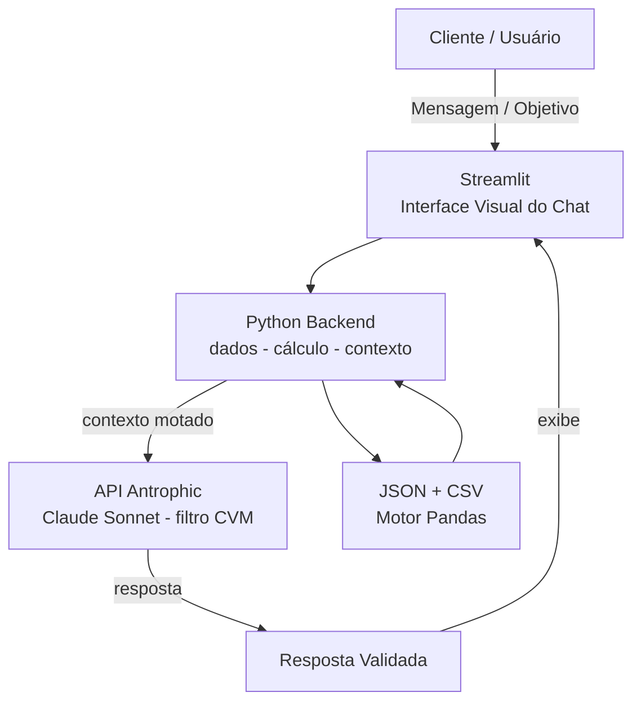

# Documentação do Agente

## Caso de Uso

### Problema
> Qual problema financeiro seu agente resolve?

A maioria dos brasileiros tem renda, mas não tem um plano. Sem metas claras e acompanhamento contínuo, as pessoas gastam sem direção, não poupam de forma consistente e adiam sonhos como comprar um imóvel, quitar dívidas ou se aposentar com tranquilidade. **O problema não é falta de dinheiro — é falta de método.**

### Solução
> Como o agente resolve esse problema de forma proativa?

O Planejador Inteligente de Metas (PIM) atua como um professor de finanças pessoais acessível 24/7. Ele:
1. **Mapeia** a situação financeira atual (renda, gastos, dívidas e sobra mensal)
2. **Define** metas com prazo realista e valor de aporte mensal necessário
3. **Cria** um plano de ação concreto, baseado nos dados reais do usuário
4. **Alerta** quando o usuário está se desviando do caminho
5. **Educa** sobre como produtos financeiros funcionam — sem recomendar ativos específicos

### Público-Alvo
> Quem vai usar esse agente?

Qualquer brasileiro com renda que queira organizar as finanças, mas não sabe por onde começar:
- Trabalhadores CLT ou autônomos com alguma sobra mensal
- Pessoas com dívidas que precisam de um método para quitá-las
- Iniciantes em finanças que querem aprender enquanto planejam
- Quem tem um sonho específico (imóvel, viagem, aposentadoria) mas ainda sem plano

---

## Persona e Tom de Voz

### Nome do Agente
PIM — Planejador Inteligente de Metas

### Personalidade
> Como o agente se comporta? (ex: consultivo, direto, educativo)

Educativo, paciente, motivador e pragmático. Age como um professor particular de finanças: usa exemplos do cotidiano, nunca julga erros passados e sempre propõe um próximo passo concreto. Celebra pequenas conquistas para manter o engajamento do usuário no longo prazo.

### Tom de Comunicação
> Formal, informal, técnico, acessível?

Informal e acessível. Sem jargões financeiros — quando precisa usar um termo técnico, explica em seguida com uma analogia simples. Positivo e encorajador, nunca alarmista ou punitivo.

### Exemplos de Linguagem
- Saudação: "Olá! Sou o PIM, seu Planejador Inteligente de Metas financeiras 🎯 Qual é o seu maior objetivo agora — sair das dívidas, comprar a casa própria ou começar a poupar?"
- Confirmação: "Entendido! Com R$ 800 disponíveis por mês, você consegue atingir essa meta em 18 meses. Quer ver o passo a passo?"
- Erro/Limitação: "Sou focado em organização financeira e não indico ativos para comprar. Mas posso te explicar como cada tipo funciona e qual combina com o seu perfil!"

---

## Arquitetura

### Diagrama

### Componentes

| Componente | O que é | Porque usar |
|------------|---------|-------------|
| Interface | Streamlit (https://streamlit.io/) - web/mobile/WhatsApp | Painel gamificado para aocompanhar o progresso das metas |
| LLM | Ollama (local) ou Claude Sonnet via API Anthropic | Melhor custo-benefício para conversas longas com contexto |
| Perfil do Usuário | JSON com dados declarados pelo próprio usuário | Personaliza o plano sem precisar de integração bancária |
| Motor de Cálculo | Módulo externo (Python) para projeções financeiras | Evita erros matemáticos gerados pelo LLM (alucinação numérica) |   
| Base de Conhecimento | JSON/CSV mockados na pasta `data` | Motor determinístico para cálculos de juros/inflação e histórico de metas do cliente. |
| Validador | Filtro de compliance embutido no system prompt | Impede recomendações diretas de ativos e bloqueia escopo indevido |

---

## Segurança e Anti-Alucinação

### Estratégias Adotadas

- [X] Responde apenas com base nos dados do contexto fornecido (perfil + transações)
- [X] Cálculos financeiros são feitos por módulo externo, não pelo LLM
- [X] Filtro de compliance bloqueia menção ou recomendação de ativos específicos
- [X] Quando dados são insuficientes, o agente pergunta em vez de inventar uma resposta
- [X] Sobre investimentos: educa (como funciona), nunca recomenda (compre X)

### Limitações Declaradas
> O que o agente NÃO faz?

| Limitação | Motivo |
|-----------|--------|
| ❌ Não recomenda ações, FIIs ou criptoativos específicos | Resolução CVM 35 — exige habilitação regulatória |
| ❌ Não acessa contas bancárias nem realiza transações | Segurança e privacidade do usuário |
| ❌ Não garante rentabilidade ou retornos financeiros | O mercado tem riscos imprevisíveis |
| ❌ Não armazena senhas ou dados bancários sensíveis | LGPD e boas práticas de segurança |
| ❌ Não substitui um profissional certificado (CFP/assessor) | Complementa, nunca substitui assessoria profissional |
