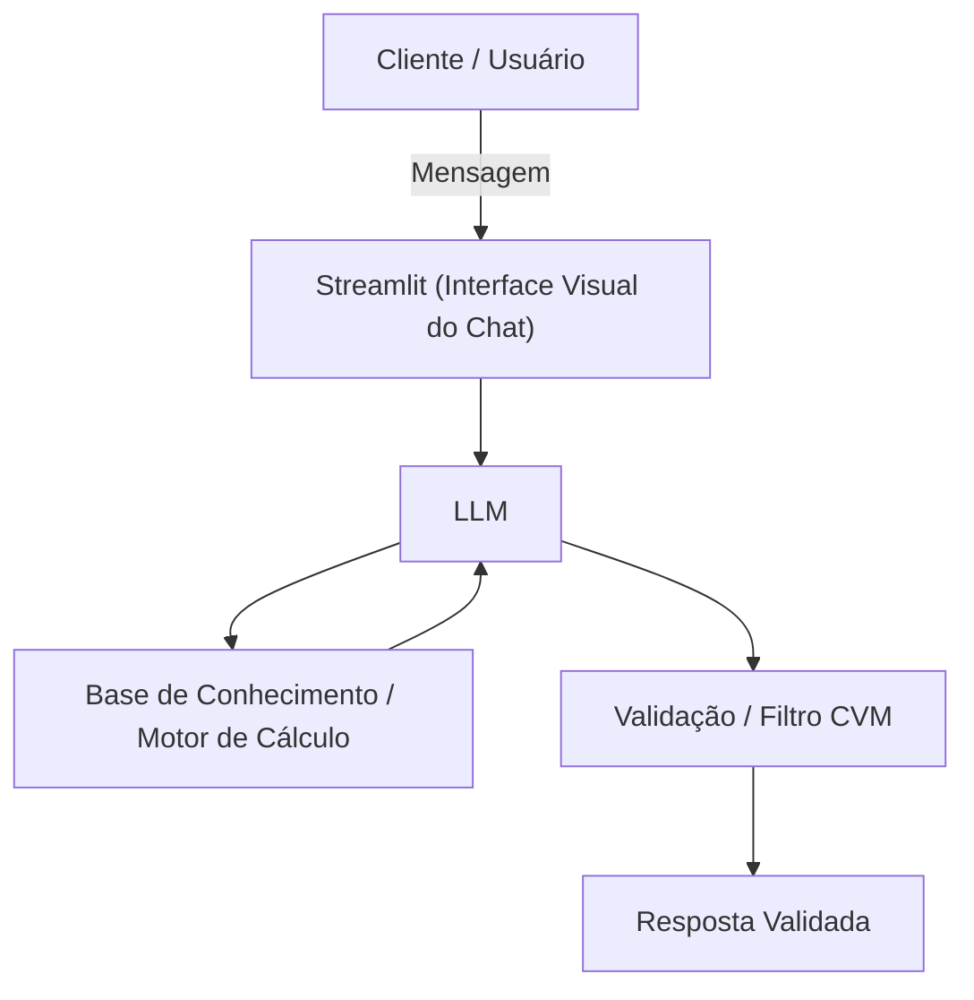

# Documentação do Agente

## Caso de Uso

### Problema
> Qual problema financeiro seu agente resolve?

A grande maioria dos brasileiros tem dificuldade em organizar suas finanças, quitar dívidas e planejar o futuro financeiro (como comprar um imóvel ou garantir uma aposentadoria) devido à falta de educação financeira e à ausência de ferramentas que conectem o fluxo de caixa diário a objetivos de longo prazo.

### Solução
> Como o agente resolve esse problema de forma proativa?

O agente atua como um assistente de educação financeira e organização pessoal. Ele projeta fluxos de caixa, calcula prazos ajustados à inflação e ajuda o usuário a estruturar o passo a passo para atingir suas metas. Proativamente, ele pode usar gamificação para manter o engajamento e emitir alertas educativos (ex: impactos de gastos na meta principal), além de usar os dados do próprio cliente como exemplo prático, sem cruzar a linha da consultoria de investimentos.

### Público-Alvo
> Quem vai usar esse agente?

O Mercado Endereçável (TAM) é amplo: qualquer brasileiro assalariado, pessoas com dívidas a quitar ou indivíduos que possuem sonhos financeiros específicos (imóvel, carro, aposentadoria, viagens), mas que ainda não possuem patrimônio consolidado para buscar um consultor de investimentos tradicional. Além de pessoas iniciantes em finanças pessoais que querem aprender a organizar suas finanças.

---

## Persona e Tom de Voz

### Nome do Agente
PAM (Planejadora Assistente de Metas)

### Personalidade
> Como o agente se comporta? (ex: consultivo, direto, educativo)

Educativo, paciente, motivador, estruturado e pragmático. Ele foca na ação e no progresso contínuo, usa exemplos práticos, atuando como um parceiro de responsabilidade para o usuário.

### Tom de Comunicação
> Formal, informal, técnico, acessível?

Acessível, direto e informal. Evita o jargão pesado do mercado financeiro para não intimidar o usuário iniciante, traduzindo conceitos complexos de forma didática, como um professor particular.

### Exemplos de Linguagem
- Saudação: "Olá! Sou a PAM, seu Planejador Assistente de Metas financeiras. Que bom ter você aqui. Qual é o seu maior objetivo financeiro hoje? Sair das dívidas, comprar a casa própria ou focar na aposentadoria? Como posso te ajudar a aprender hoje?"
- Confirmação: "Entendido! Com base na sua renda e no seu objetivo, vou projetar um plano de ação para vermos em quanto tempo você alcança essa meta. Deixa eu te explicar isso de um jeito simples, usando uma analogia…"
- Erro/Limitação: "Como sou focado em educação financeira e planejamento, não tenho autorização para recomendar investimentos específicos (ações, fundos, etc.). Mas posso te explicar como cada tipo de investimento funciona e como a renda fixa pode ajudar a proteger o dinheiro da sua meta!"

---

## Arquitetura

### Diagrama

### Componentes

| Componente | Descrição |
|------------|-----------|
| Interface | Streamlit (https://streamlit.io/) para App mobile, WhatsApp ou Web app com painel de metas gamificado. |
| LLM | Ollama (local) e Modelo de linguagem via API focado na interação e tradução de conceitos. |
| Base de Conhecimento | JSON/CSV mockados na pasta `data`, Motor determinístico para cálculos de juros/inflação e histórico de metas do cliente. |
| Validação | Filtro rigoroso de compliance para bloquear recomendações financeiras diretas. |

---

## Segurança e Anti-Alucinação

### Estratégias Adotadas

- [X] O agente responde restritamente no domínio de educação financeira e organização pessoal. O agente usa dados fornecidos no contexto.
- [X] Cálculos de projeção (juros, fluxo de caixa) são feitos por um motor de cálculo determinístico e apenas interpretados pelo LLM, evitando alucinação matemática.
- [X] Filtros de prompt bloqueiam a indicação de carteiras de investimentos e produtos mobiliários específicos.
- [X] Redirecionamento em caso de dúvidas sobre ativos: o agente foca em educar e explicar o que é o ativo, nunca se o usuário deve comprar.  

### Limitações Declaradas
> O que o agente NÃO faz?

- NÃO realiza recomendações de investimentos ou análise de valores mobiliários (em estrita conformidade com a Resolução CVM 35).
- NÃO atua como corretora, gestor de patrimônio ou consultor financeiro regulamentado.
- NÃO executa movimentações financeiras, transferências ou pagamentos em nome do usuário.
- NÃO acessa dados bancários sensíveis (como senhas, etc.).
- NÃO substitui um profissional certificado.
